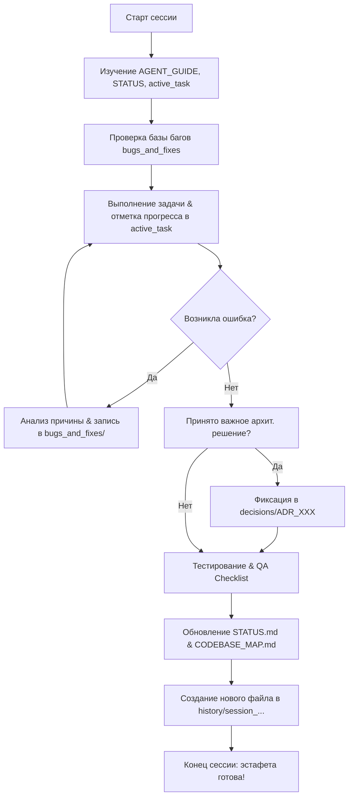

# 🧠 Второй Мозг Проекта: Полная Инструкция для Агентов (AGENT_GUIDE.md)

Добро пожаловать в проект **{{PROJECT_NAME}}**!

Этот каталог `agents/` является **полноценным Вторым Мозгом (Second Brain)** проекта. Здесь хранится вся долговременная память, стандарты разработки, архитектурные решения, база знаний по багам, шаблоны и регламенты. Любой агент, подключившийся к проекту, обязан работать через эту экосистему.

---

## ⚡ ГЛАВНОЕ ПРАВИЛО ДЛЯ ЛЮБОГО АГЕНТА:
> Любой входящий агент **ОБЯЗАН** перед внесением любых изменений в код полностью изучить правила:
> 👉 **[`agents/rules/AGENT_RULES.md`](file:///agents/rules/AGENT_RULES.md)**  
> и список строгих запретов:  
> 👉 **[`agents/rules/ANTI_PATTERNS.md`](file:///agents/rules/ANTI_PATTERNS.md)**

---

## 🗺️ Полная Карта «Второго Мозга» (`agents/`)

```
agents/
├── AGENT_GUIDE.md                 # 🌟 Главный навигатор по «Второму Мозгу» (этот файл)
├── STATUS.md                      # 📊 Живой дашборд состояния проекта в реальном времени
├── GLOSSARY.md                    # 📖 Глоссарий терминов предметной области проекта
│
├── rules/                         # 📜 Обязательные регламенты для агентов
│   ├── AGENT_RULES.md             # Правило №0, порядок входа, работы и передачи эстафеты
│   ├── ANTI_PATTERNS.md           # Строгие запреты (секреты, затирание истории, регрессии)
│   ├── CODING_STANDARDS.md        # Стандарты архитектуры, типизации и чистоты кода
│   └── ONBOARDING_PROTOCOL.md     # Протокол авто-инициализации при развертывании шаблона
│
├── templates/                     # 📐 Стандартизированные бланки (заполнять только их!)
│   ├── template_session_log.md    # Шаблон отчета о сессии в history/
│   ├── template_bug_report.md     # Шаблон баг-репорта (Симптом ➔ Причина ➔ Решение)
│   ├── template_task.md           # Шаблон карточки новой задачи
│   ├── template_adr.md            # Шаблон архитектурного решения (ADR)
│   └── template_component_spec.md # Шаблон спецификации модуля/компонента
│
├── architecture/                  # 🏗️ Архитектурные спецификации и схемы
│   ├── CODEBASE_MAP.md            # Карта кодовой базы и граф зависимостей между файлами
│   ├── SYSTEM_DESIGN.md           # Архитектура всей системы, потоки данных и стек
│   └── SECURITY_SPEC.md           # Модель безопасности, защита данных и управление секретами
│
├── decisions/                     # 🏛️ Каталог архитектурных решений (ADR)
│   ├── README.md                  # Как правильно оформлять и фиксировать решения
│   └── ADR_000_example.md         # Эталонный пример оформления ADR
│
├── bugs_and_fixes/                # 🐛 База знаний по ошибкам и багам (ПОЧЕМУ возникли и как решены)
│   ├── README.md                  # Регламент фиксации ошибок
│   └── BUG_000_example.md         # Эталонный пример разбора бага (Симптом -> Причина -> Фикс)
│
├── tasks/                         # 📋 Управление задачами
│   ├── active_task.md             # Активная задача с чеклистом (заполняется в реальном времени)
│   ├── backlog.md                 # Бэклог задач и идей на будущее
│   └── archive/                   # Архив выполненных задач
│
├── history/                       # 📝 Инкрементальный журнал сессий (строго без перезаписи!)
│   ├── README.md                  # Регламент сохранения истории сессий
│   └── session_000_init_example.md# Эталонный пример записи о сессии
│
├── registry/                      # 👤 Реестр агентов (кто работал над проектом)
│   ├── README.md                  # Правила регистрации агентов
│   └── agent_profile_template.md  # Шаблон профиля нового агента
│
├── deployment/                    # 🚀 Руководства по развертыванию
│   └── DEPLOYMENT_RUNBOOK.md      # Инструкция деплоя (Docker, Systemd, Nginx, SSL, CI/CD)
│
├── runbooks/                      # 🚑 Аварийный справочник на случай сбоев
│   └── TROUBLESHOOTING.md         # Решение типовых проблем (порты, сетевые сбои, кэш)
│
├── testing/                       # 🧪 Тестирование и контроль качества
│   └── QA_CHECKLIST.md            # Обязательный чек-лист регрессионной проверки
│
├── plans/                         # 📐 Implementation Plans (большие многоэтапные планы)
├── walkthroughs/                  # 🚀 Walkthroughs (отчеты о приемке и тестировании фич)
│
└── tools/                         # 🛠️ Скрипты автоматизации (чистый Python, без сторонних либ)
    ├── check_integrity.py         # Проверка целостности Второго Мозга
    └── init_project.py            # Быстрая инициализация шаблона под новый проект
```

---

## 🔄 Рабочий цикл агента: Как работать с проектом



---

## 🔄 Как передавать эстафету, если сессия оборвалась:
1. Следующий входящий агент открывает `agents/STATUS.md` и `agents/tasks/active_task.md`.
2. Находит первый незавершенный пункт `[ ]`.
3. Сверяется с `agents/rules/ANTI_PATTERNS.md` и `agents/bugs_and_fixes/`.
4. Продолжает реализацию ровно с места остановки.
5. По завершении добавляет новую запись в `agents/history/`.
