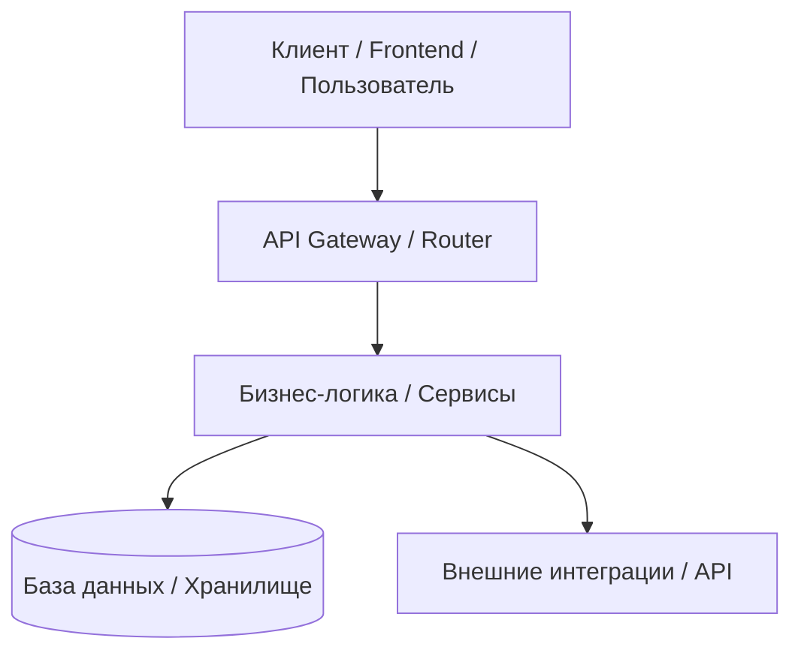

# 🗺️ Карта кодовой базы и граф зависимостей (CODEBASE_MAP.md)

**Проект:** {{PROJECT_NAME}}  
**Последнее обновление:** {{LAST_UPDATED}}  

Этот документ помогает любому входящему агенту за 30 секунд понять файловую структуру проекта, назначение каждого модуля и связи между ними.

---

## 🏗️ Архитектурный граф модулей (Component Graph)



---

## 📁 Структура каталогов и файлов проекта

```
{{PROJECT_NAME}}/
├── agents/                       # 🧠 «Второй Мозг» проекта (долговременная память)
│   ├── STATUS.md                 # Дашборд состояния
│   ├── AGENT_GUIDE.md            # Главный навигатор
│   └── ...
├── src/                          # 💻 Исходный код приложения
│   ├── api/                      # Роуты, эндпоинты, контроллеры
│   ├── services/                 # Бизнес-логика и сервисы
│   ├── models/                   # Модели данных и схемы валидации
│   └── config/                   # Конфигурация и переменные окружения
├── tests/                        # 🧪 Тесты (юнит, интеграционные, e2e)
├── .env.example                  # Образец переменных окружения (без секретов!)
├── README.md                     # Документация проекта для людей
└── AGENTS.md                     # Входная точка для AI-агентов
```

---

## 📋 Таблица ответственности ключевых файлов

| Путь к файлу / модулю | Назначение и ответственность | Ключевые функции / классы | Что проверить при изменении |
|---|---|---|---|
| `src/main.py` (или `index.ts`) | Точка входа в приложение | Инициализация сервера, подключение middleware | Запуск приложения, порты |
| `src/config.py` (или `env.ts`) | Конфигурация проекта | Чтение `.env`, валидация настроек | Корректность дефолтных значений |
| `src/models/` | Схемы данных и DTO | Валидация входных/выходных данных | Совместимость с фронтендом и БД |
| `src/services/` | Бизнес-логика | Реализация алгоритмов и операций | Юнит-тесты сервисов |
| `tests/` | Набор авто-тестов | Проверка регрессий и работоспособности | Запуск тестового раннера (`pytest` / `vitest`) |

> [!TIP]
> При добавлении или удалении файлов в проекте агент обязан поддерживать эту таблицу в актуальном состоянии!
