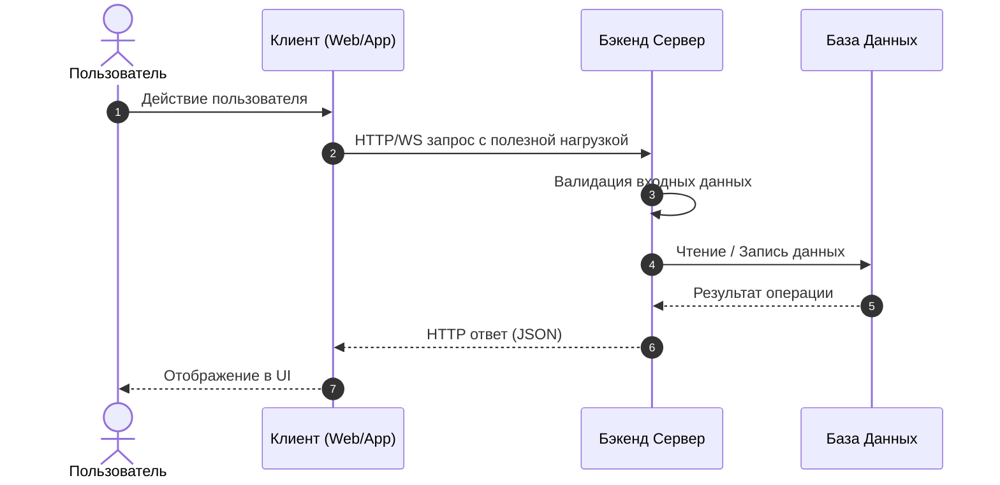

# 🏛️ Архитектура Системы (SYSTEM_DESIGN.md)

**Проект:** {{PROJECT_NAME}}  
**Описание:** {{PROJECT_DESCRIPTION}}  

Документ описывает высокоуровневую архитектуру, ключевые компоненты, потоки данных и технические решения проекта.

---

## 1. Общий обзор архитектуры (High-Level Overview)
- **Архитектурный стиль:** [Например: Монолит / Модульный монолит / Микросервисы / Serverless]
- **Стек технологий:**
  - **Основной язык:** [Python / TypeScript / Go / Rust]
  - **Фреймворк:** [FastAPI / Next.js / NestJS / Express / Django]
  - **База данных:** [PostgreSQL / SQLite / MongoDB / Redis]
  - **Очереди / Брокеры (если есть):** [RabbitMQ / Celery / BullMQ]
  - **Клиентская часть:** [Vanilla JS / React / Vue / Flutter]

---

## 2. Потоки данных (Data Flow)

---

## 3. Модель хранения данных (Storage & Persistence)
- **Тип хранения:** [Реляционная БД / Документная БД / In-Memory / Файловая система]
- **Ключевые сущности:**
  - `User`: Пользователь системы, учетные данные, права.
  - `Session`: Сессия взаимодействия.
  - `[Сущность 1]`: Основная бизнес-сущность проекта.

---

## 4. Масштабируемость и отказоустойчивость
- Поддержка горизонтального масштабирования (Stateless архитектура).
- Graceful Shutdown при перезагрузке или остановке контейнера.
- Политика тайм-аутов и повторных попыток (Retry Policy) для внешних запросов.
